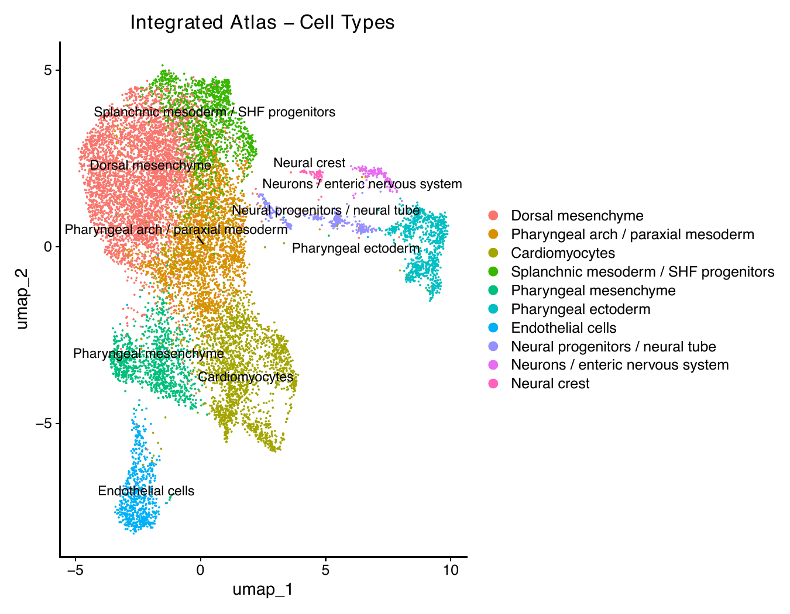
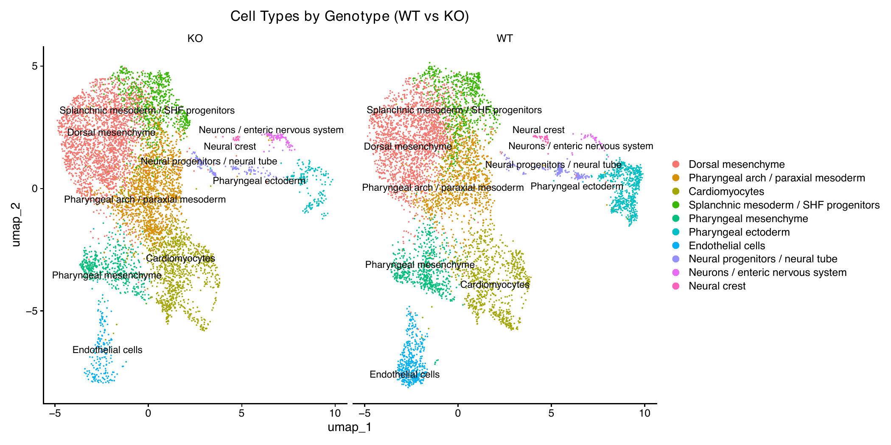
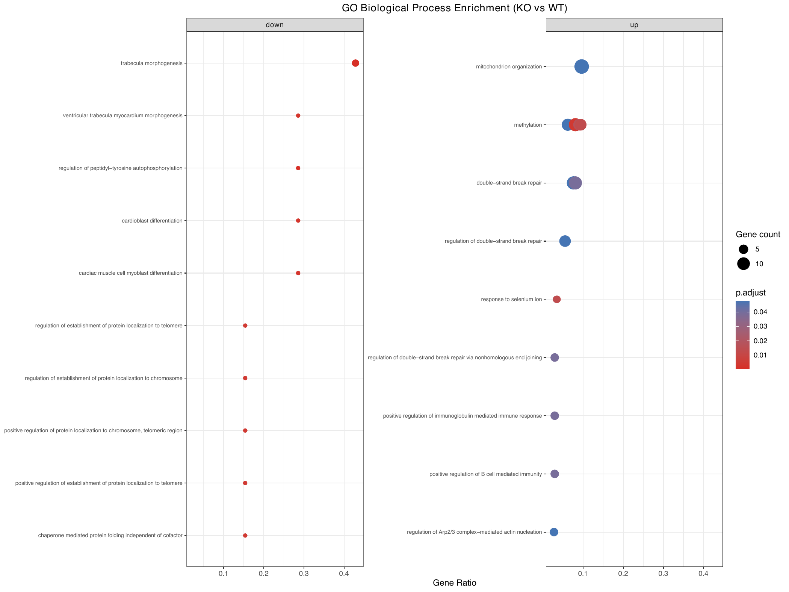

# Tbx1 Cardiopharyngeal Lineage — Conditional Knockout scRNA-seq Pipeline

**Tbx1** is a T-box transcription factor expressed in the 
cardiopharyngeal mesoderm and essential for pharyngeal arch 
and second heart field (SHF) development. Loss of Tbx1 
causes cardiovascular and craniofacial defects that model 
the cardiac features of DiGeorge/22q11.2 deletion syndrome 
([Jerome & Papaioannou, 2001](https://doi.org/10.1038/85845); 
[Lindsay et al., 2001](https://doi.org/10.1038/35065105)).

This pipeline characterizes the **cell-autonomous** 
transcriptional consequences of Tbx1 loss using a 
conditional knockout model (*Tbx1*^Cre/flox^; 
*Rosa26*-GFP^flox/+^), in which Tbx1 is deleted 
specifically within Tbx1-expressing lineage cells. 
The Rosa26-GFP reporter enables tracking of Tbx1-lineage 
cells after gene deletion. Analysis spans two timepoints 
(E8.5 and E9.5) — the window of active SHF specification 
and cardiac progenitor commitment — comparing WT and 
conditional KO to identify transcriptional changes driven 
by cell-autonomous Tbx1 loss.

This is an alternative analysis of the dataset from 
[Nomaru et al. (2021)](https://doi.org/10.1038/s41467-021-26966-6) 
using a Seurat/scVI/Nextflow toolchain in place of the 
original Scran/RISC/Scanpy stack — methodological 
divergences are documented throughout.

---

## Table of Contents

1. [What this pipeline does](#what-this-pipeline-does)
2. [Why the pipeline is built this way](#why-the-pipeline-is-built-this-way)
3. [Pipeline architecture](#pipeline-architecture)
4. [Repository structure](#repository-structure)
5. [Requirements](#requirements)
6. [How to run](#how-to-run)
7. [Samples](#samples)
8. [Results — Key findings](#results--key-findings)
9. [Integration method rationale](#integration-method-rationale)
10. [Statistical approach and limitations](#statistical-approach-and-limitations)
11. [Citation](#citation)

---

## What this pipeline does

This repository processes four single-cell RNA-seq samples from a Tbx1 conditional knockout mouse model — two wild-type timepoints (e85, e95) and two knockout timepoints (ko-e85, ko-e95) — through a four-phase Nextflow pipeline. Phase 1 downloads raw count matrices from GEO, constructs per-sample Seurat objects, applies QC filtering and SCTransform normalization, performs dimensionality reduction and Louvain clustering, and runs a clustree resolution sweep. Phase 2 consumes the phase 1 clustered objects, identifies marker genes, plots feature maps for curated cardiopharyngeal markers, and applies human-provided cluster labels to each sample individually. Phase 3a integrates all four samples into a single atlas using scVI, re-clusters the joint embedding at resolution 0.4 (producing 10 clusters), and identifies shared marker genes across all samples. Phase 3b takes the integrated atlas, applies a single set of biologically validated cluster labels, runs pseudobulk differential expression (DESeq2, design `~ timepoint + genotype`) for each cell type comparing KO to WT, and performs GO biological process enrichment (clusterProfiler) on significant DE genes. All four phases have been run; results are written to `results/phase{1,3a,3b}/`.

---

## Why the pipeline is built this way

### Phased design

Per-sample QC, filtering, and normalization (phase 1) are separated from cross-sample integration (phase 3a) because the two operations require different inputs and produce different granularity of results. Cluster annotation is deliberately human-in-the-loop at two stages: per-sample in phase 2 (using individual sample context) and integrated-atlas in phase 3b (using the joint embedding). Deterministic, parameter-driven steps are automated in the pipeline; steps requiring biological judgment — cluster annotation and trajectory root selection — are handed off as human-provided CSV files that the pipeline applies. This mirrors the design rationale used in the companion mesp1 pipeline.

### Integration method choice

**scVI for Ctrl vs KO integration (this pipeline):** The four samples span two genotypes (WT, KO) and two timepoints (E8.5, E9.5). Integration uses scVI with `batch_key="sample_id"`, which removes sample-level technical batch, and `categorical_covariate_keys=["genotype"]`, which explicitly models genotype as a known biological variable — preserving the KO phenotype in the embedding rather than correcting it away. Using fastMNN here would be inappropriate: fastMNN identifies mutual nearest neighbours between samples and merges them, which would actively erase genotype-driven expression differences — the very signal this experiment is designed to detect.

**fastMNN for homogeneous timecourse (alternative):** When samples share the same genotype and vary only across a biological continuum (e.g., developmental time), fastMNN is preferable because its aggressive merging of nearest-neighbour pairs is appropriate — there is no phenotypic signal to protect. See the companion mesp1 pipeline for an applied example of this design.

### Pseudobulk DESeq2

Per-cell Wilcoxon tests (the Seurat default) inflate statistical power by treating each cell as an independent replicate, when in reality cells from the same animal are correlated — a pseudoreplication error that produces systematically anti-conservative p-values. Pseudobulk analysis aggregates raw counts per sample per cell type before testing, reducing to one observation per biological replicate per group, and applies a count model (DESeq2) appropriate for RNA-seq data. The honest limitation here is that with only one WT and one KO animal per timepoint, pooling across timepoints (design `~ timepoint + genotype`) is required to obtain estimable dispersion; timepoint is a blocking factor, not a replicate. Results should be treated as hypothesis-generating rather than conclusive — replication across additional animals would be required for confirmatory inference.

### Samplesheet/params design

All four samples are fully parametrized via YAML files under `phase{N}/params/`. Switching between samples requires only a `-params-file` flag. Three execution profiles (`apple_silicon`, `low_mem`, `hpc`) tune memory and CPU allocation without touching pipeline logic. The conda profile pins the R and Python environments to reproducible specifications (`scrna.yml`, `phase3a/env.yml`).

---

## Pipeline architecture

### Phase 1 — Per-sample QC, normalization and clustering (linear DAG)

```
DOWNLOAD_DATA
    → CREATE_SEURAT_OBJECT
    → VISUALIZE_QC
    → FILTER_CELLS
    → NORMALIZE_DATA (SCTransform)
    → DIM_REDUCTION_AND_CLUSTER (PCA → UMAP → Louvain)
    → RUN_CLUSTREE
```

Run once per sample (`tbx1-E85.yml`, `tbx1-E95.yml`, `tbx1-KO-E85.yml`, `tbx1-KO-E95.yml`).

### Phase 2 — Per-sample marker finding and annotation (fan-out DAG)

```
                ┌── FIND_MARKERS
clustered_rds ──┼── PLOT_MARKER_GENES
                └── ANNOTATE_CLUSTERS  ← cluster_labels CSV (human input)
```

Run once per sample with human-provided `cluster_labels` CSV.

### Phase 3a — Cross-sample scVI integration (fan-in DAG)

```
wt_e85 ─┐
wt_e95 ─┤
         ├─ 4× PREP_NORMALIZE ── .collect() ──→ INTEGRATE_SCVI
ko_e85 ─┤                                             │
ko_e95 ─┘                                       CLUSTER_INTEGRATED
                                                 ┌────┴────┐
                                            RUN_CLUSTREE  FIND_MARKERS
```

### Phase 3b — Annotation, DE and enrichment (linear DAG)

```
ANNOTATE_ATLAS  ← cluster_labels_integrated.csv (human input)
    → DIFFERENTIAL_EXPRESSION  (pseudobulk DESeq2, ~ timepoint + genotype)
    → ENRICHMENT               (clusterProfiler enrichGO, BP, org.Mm.eg.db)
```

---

## Repository structure

```
tbx1/
├── phase1/
│   ├── main.nf                  # 7-process per-sample pipeline
│   ├── nextflow.config
│   ├── params/
│   │   ├── tbx1-E85.yml
│   │   ├── tbx1-E95.yml
│   │   ├── tbx1-KO-E85.yml
│   │   └── tbx1-KO-E95.yml
│   └── scripts/
│       ├── 02_create_seurat_obj.R
│       ├── 03_qc_visualize.R
│       ├── 04_filter_cells.R
│       ├── 05_normalize_data.R
│       ├── 06_run_dim_reduction.R
│       └── 07_run_clustree.R
├── phase2/
│   ├── main.nf                  # 3-process annotation pipeline
│   ├── nextflow.config
│   ├── params/
│   │   ├── tbx1-E85.yml
│   │   ├── tbx1-E95.yml
│   │   ├── tbx1-KO-E85.yml
│   │   └── tbx1-KO-E95.yml
│   └── scripts/
│       ├── 01_find_markers.R
│       ├── 02_plot_marker_genes.R
│       └── 03_annotate_clusters.R
├── phase3a/
│   ├── main.nf                  # 5-process scVI integration pipeline
│   ├── nextflow.config
│   ├── env.yml                  # Python env for scVI (INTEGRATE_SCVI only)
│   ├── params/
│   │   └── tbx1-ctrl-vs-ko.yml
│   └── scripts/
│       ├── 01_prep_normalize.R
│       ├── 02_integrate_scvi.py
│       ├── 03_cluster_integrated.R
│       ├── 04_run_clustree.R
│       └── 05_find_markers.R
├── phase3b/
│   ├── main.nf                  # 3-process DE and enrichment pipeline
│   ├── nextflow.config
│   ├── cluster_labels_integrated.csv  # human-provided atlas labels
│   ├── params/
│   │   └── tbx1-phase3b.yml
│   └── scripts/
│       ├── 01_annotate_atlas.R
│       ├── 02_differential_expression.R
│       └── 03_enrichment.R
├── config/
│   └── cluster_labels/          # per-sample annotation CSVs (phase 2)
│       ├── e85.csv
│       ├── e95.csv
│       ├── ko-e85.csv
│       └── ko-e95.csv
├── scrna.yml                    # R conda environment (phases 1, 2, 3a, 3b)
└── results/
    ├── phase1/
    │   ├── e85/                 # objects/, plots/, tables/, pipeline_info/
    │   ├── e95/
    │   ├── ko-e85/
    │   └── ko-e95/
    ├── phase3a/
    │   └── integrated/          # objects/, plots/, tables/, pipeline_info/
    └── phase3b/
        ├── objects/             # 01_annotated_atlas.rds
        ├── plots/               # annotated UMAPs, enrichment dotplot
        ├── tables/
        │   └── de_results/      # per-cell-type DESeq2 CSVs
        └── pipeline_info/
```

---

## Requirements

- [Nextflow](https://nextflow.io/) ≥ 26.04.0
- [Conda](https://docs.conda.io/) (Miniconda or Anaconda)

### Conda environments

| Environment file | Used by | Key packages |
|---|---|---|
| `scrna.yml` | phase1, phase2, phase3a (R steps), phase3b | Seurat 5.5, SCTransform, DESeq2, clusterProfiler, org.Mm.eg.db, clustree, tidyverse, R 4.4.3 |
| `phase3a/env.yml` | phase3a `INTEGRATE_SCVI` only | scvi-tools, anndata, scanpy, Python 3 |

Both environments are built automatically by Nextflow when running with `-profile conda`. Cached builds are stored in `~/.conda/nextflow-envs/`.

---

## How to run

Phases must be run in order. Phase 2 requires phase 1 clustered objects; phase 3a requires phase 1 filtered objects; phase 3b requires the phase 3a integrated object and a human-provided `cluster_labels_integrated.csv`.

### Phase 1 — Per-sample QC and clustering

```bash
# Run all four samples (order-independent; can run in parallel)
nextflow run phase1/main.nf -profile conda,apple_silicon \
    -params-file phase1/params/tbx1-E85.yml

nextflow run phase1/main.nf -profile conda,apple_silicon \
    -params-file phase1/params/tbx1-E95.yml

nextflow run phase1/main.nf -profile conda,apple_silicon \
    -params-file phase1/params/tbx1-KO-E85.yml

nextflow run phase1/main.nf -profile conda,apple_silicon \
    -params-file phase1/params/tbx1-KO-E95.yml
```

### Phase 2 — Per-sample marker finding and annotation

Populate `config/cluster_labels/{e85,e95,ko-e85,ko-e95}.csv` (columns: `cluster_id`, `label`) before running.

```bash
nextflow run phase2/main.nf -profile conda,apple_silicon \
    -params-file phase2/params/tbx1-E85.yml

nextflow run phase2/main.nf -profile conda,apple_silicon \
    -params-file phase2/params/tbx1-E95.yml

nextflow run phase2/main.nf -profile conda,apple_silicon \
    -params-file phase2/params/tbx1-KO-E85.yml

nextflow run phase2/main.nf -profile conda,apple_silicon \
    -params-file phase2/params/tbx1-KO-E95.yml
```

### Phase 3a — scVI integration and clustering

```bash
nextflow run phase3a/main.nf -profile conda,apple_silicon \
    -params-file phase3a/params/tbx1-ctrl-vs-ko.yml
```

Before proceeding: inspect `results/phase3a/integrated/plots/04_clustree_resolutions.pdf` and `results/phase3a/integrated/tables/05_top5_markers_per_cluster.csv` to choose a resolution and assign biological labels. Record labels in `phase3b/cluster_labels_integrated.csv` (columns: `cluster_id`, `label`).

### Phase 3b — Annotation, DE and enrichment

```bash
nextflow run phase3b/main.nf -profile conda,apple_silicon \
    -params-file phase3b/params/tbx1-phase3b.yml
```

---

## Samples

| Sample ID | Genotype | Timepoint | GEO accession | Description |
|---|---|---|---|---|
| e85 | WT | E8.5 | GSM5169142 | Wild-type, cardiac crescent / early heart tube |
| e95 | WT | E9.5 | GSM5169144 | Wild-type, looping heart / pharyngeal arch expansion |
| ko-e85 | Conditional KO | E8.5 | GSM5169143 | Tbx1Cre/flox; Rosa26-GFP, E8.5 |
| ko-e95 | Conditional KO | E9.5 | GSM5169145 | Tbx1Cre/flox; Rosa26-GFP, E9.5 |

Phase 3a integrates all four samples: 13,574 cells after QC and per-sample normalization, embedded into 30 scVI latent dimensions and clustered at resolution 0.4 (10 clusters).

---

## Results — Key findings

Single-cell analysis of 13,574 Tbx1-lineage cells across 
WT and conditional KO at E8.5 and E9.5 resolved 10 
transcriptionally distinct populations. Conditional Tbx1 
loss produces a progressive, multifaceted phenotype:

### Per-sample analysis (Phase 2)

| Finding | Evidence |
|---|---|
| **Neural crest loss** | Sox10+ neural crest present at E8.5 but showing aberrant epithelial markers (Epcam+); near-absent by E9.5 (KO: 6 cells vs WT: 22 cells) |
| **SHF specification failure** | Nkx2-6 lost from SHF/cardiopharyngeal progenitors at E8.5 — the earliest molecular evidence of the KO phenotype |
| **Cardiomyocyte isoform shift** | WT cardiomyocytes express atrial/fast isoforms (Myh6/Myl2); KO cardiomyocytes shift to ventricular/slow isoforms (Myh7/Myl3) at E9.5 |
| **KO-specific neuronal population** | Neurod4/Tlx2/Tlx3+ enteric/autonomic neuron population appears exclusively in KO E9.5 — absent in WT |
| **Pharyngeal ectoderm disruption** | WT E9.5 has 638 pharyngeal ectoderm cells (Vgll2/Plet1/Krt7) vs 166 in KO |

### Integrated atlas (Phase 3a)

scVI integration of all four samples produced 10 clusters 
spanning shared and condition-specific populations:

- **Shared lineages** (Clusters 0–5, 7): present in both 
  WT and KO — cardiomyocytes, endothelium, splanchnic 
  mesoderm, pharyngeal mesenchyme
- **WT-enriched** (Cluster 5): pharyngeal ectoderm — 
  638 WT E9.5 vs 166 KO E9.5 cells
- **KO-enriched** (Clusters 0, 1): dorsal mesenchyme and 
  pharyngeal arch / paraxial mesoderm — KO-expanded, 
  consistent with compensatory or stalled progenitor 
  accumulation
- **KO-specific** (Cluster 8): neurons / enteric nervous 
  system (Neurod4/Tlx2) — near-absent in WT
- **WT-enriched, near-absent in KO** (Cluster 9): neural 
  crest (Sox10/Tfap2b/Dlx1/Dlx2) — confirmed at atlas level



*Integrated scVI atlas: annotated cell types across all four samples (WT E8.5/E9.5, KO E8.5/E9.5).*

### Differential expression and enrichment (Phase 3b)

Pseudobulk DESeq2 (design `~ timepoint + genotype`) 
across 9 cell types revealed predominantly upregulated 
genes in KO (compensatory/stress programs) with selective 
downregulation in cardiomyocytes:

| Cell type | Sig up (KO) | Sig down (KO) | Top enriched pathway |
|---|---|---|---|
| Cardiomyocytes | 98 | 11 | **Trabecula morphogenesis** (down) — cardiac maturation impaired |
| Dorsal mesenchyme | 165 | 15 | Mitochondrion organization (up), telomere maintenance (down) |
| Pharyngeal ectoderm | 156 | 1 | — |
| Pharyngeal mesenchyme | 106 | 7 | Aortic valve morphogenesis (down) |
| Endothelial cells | 98 | 0 | — |
| Pharyngeal arch / paraxial | 103 | 5 | — |
| Splanchnic mesoderm / SHF | 97 | 0 | Methylation (up) |



*Same atlas faceted by genotype. KO-enriched clusters (dorsal mesenchyme, pharyngeal arch) and the WT-specific neural crest population (Cluster 9) are visible as condition-specific structure.*

**The most specific finding:** downregulation of trabecula 
morphogenesis, ventricular trabecula myocardium 
morphogenesis, cardioblast differentiation, and cardiac 
muscle cell myoblast differentiation in KO cardiomyocytes 
— indicating that Tbx1 loss impairs not just progenitor 
specification but the downstream maturation of the 
cardiomyocytes that do form.

> **Note:** Results are hypothesis-generating — see 
> [Statistical approach and limitations](#statistical-approach-and-limitations).

#### GO enrichment



*Top GO biological process terms across cell types. Cardiomyocyte cluster shows downregulation of trabecula morphogenesis and cardiomyocyte differentiation pathways — the most specific developmental finding.*

---

## Integration method rationale

The choice of integration method is not interchangeable — 
it must match the biological question.

**Why scVI for this pipeline:**

This experiment spans two variables simultaneously: 
technical batch (four separate 10x runs) and biological 
condition (WT vs KO genotype). Any integration method 
must remove the technical batch while *preserving* the 
genotype-driven expression differences — because those 
differences are the scientific signal being measured.

scVI achieves this via explicit variable modeling:

```python
scvi.model.SCVI.setup_anndata(
    combined,
    batch_key                  = "sample_id",   # remove technical batch
    categorical_covariate_keys = ["genotype"],  # preserve this signal
)
```

`batch_key="sample_id"` tells the model that 
sample-to-sample differences are unwanted technical 
variation. `categorical_covariate_keys=["genotype"]` 
tells the model that genotype is a known biological 
variable to account for — not to correct away.

**Why fastMNN would be wrong here:**

fastMNN finds mutual nearest neighbors across datasets 
and pulls them together. Applied to WT vs KO, it would 
identify "WT cardiomyocytes ↔ KO cardiomyocytes" as the 
same cell type and force their expression profiles toward 
each other — erasing the Tbx1-dependent transcriptional 
differences. Downstream DE analysis would find nothing, 
because the phenotype would have been mathematically 
removed during integration. See the companion 
[mesp1 pipeline](https://github.com/drgideonobeng/mesp1) 
for a case where fastMNN *is* appropriate — a homogeneous 
control timecourse where batch is the only unwanted 
inter-sample difference.

**The general principle:**

| Situation | Method | Reason |
|---|---|---|
| Same cell types across batches (homogeneous) | fastMNN | Merge nearest neighbors — batch is the only difference |
| Same cell types, perturbed expression (heterogeneous) | scVI with covariate | Preserve condition effect while removing batch |
| Unknown structure | Benchmark multiple methods | Don't assume |

---

## Statistical approach and limitations

### Pseudobulk DESeq2

Per-cell Wilcoxon tests treat each cell as an independent 
observation — but all cells from the same animal are 
correlated. This pseudoreplication inflates sample size 
and produces systematically over-confident p-values. 
Pseudobulk analysis corrects this by aggregating raw 
counts per sample per cell type before testing, reducing 
to one observation per biological sample, and applying 
DESeq2 — a negative binomial model validated for RNA-seq 
count data.

### The honest limitation: timepoints as replicates

This experiment has one WT and one KO animal per 
timepoint. With n=1 per condition per timepoint, DESeq2 
cannot estimate biological dispersion from true 
replicates. To obtain an estimable design, the two 
timepoints are pooled per genotype and timepoint is 
modeled as a blocking variable:

design = ~ timepoint + genotype

This treats wt_e85 and wt_e95 as "WT replicates" and 
ko_e85 and ko_e95 as "KO replicates" — which is 
statistically necessary but biologically imprecise, 
since the two timepoints differ in developmental stage, 
not just noise.

**Practical implications:**
- Results should be treated as **hypothesis-generating** 
  rather than statistically definitive
- Large effect sizes (|log2FC| > 1) with padj < 0.05 
  are more reliable than borderline findings
- Findings consistent with Phase 2 per-sample 
  observations (which used independent clustering) 
  carry additional support
- Confirmatory inference would require biological 
  replicates within each condition × timepoint

### Alternative approach

limma-voom with empirical Bayes moderation is better 
suited to small-n designs than DESeq2 and would be 
appropriate as a sensitivity analysis. Genes significant 
in both DESeq2 and limma-voom analyses would represent 
the highest-confidence findings.

---

## Citation

**Tbx1 / DiGeorge syndrome:**

> Jerome LA, Papaioannou VE (2001). DiGeorge syndrome 
> phenotype in mice mutant for the T-box gene, Tbx1. 
> *Nature Genetics*, 27(3), 286–291.
> https://doi.org/10.1038/85845

> Lindsay EA, Vitelli F, Su H, et al. (2001). Tbx1 
> haploinsufficiency in the DiGeorge syndrome region 
> causes aortic arch defects in mice. *Nature*, 410, 
> 97–101. https://doi.org/10.1038/35065105

**Dataset:**
> Nomaru H, Liu Y, De Bono C, et al. (2021). Single cell 
> multi-omic analysis identifies a Tbx1-dependent 
> multilineage primed population in murine 
> cardiopharyngeal mesoderm. *Nature Communications*, 
> 12(1), 6645. https://doi.org/10.1038/s41467-021-26966-6

**Tools used in this pipeline:**

- **Seurat v5** — Hao et al. (2024). *Nature Methods.* https://doi.org/10.1038/s41592-024-02212-7
- **SCTransform** — Hafemeister & Satija (2019). *Genome Biology.* https://doi.org/10.1186/s13059-019-1874-1
- **scVI** — Lopez et al. (2018). *Nature Methods.* https://doi.org/10.1038/s41592-018-0229-2
- **DESeq2** — Love et al. (2014). *Genome Biology.* https://doi.org/10.1186/s13059-014-0550-8
- **clusterProfiler** — Wu et al. (2021). *The Innovation.* https://doi.org/10.1016/j.xinn.2021.100141
- **clustree** — Zappia & Oshlack (2018). *GigaScience.* https://doi.org/10.1093/gigascience/giy083
- **Nextflow** — Di Tommaso et al. (2017). *Nature Biotechnology.* https://doi.org/10.1038/nbt.3820
- **fastMNN** [companion mesp1 pipeline] — Haghverdi et al. (2018). *Nature Biotechnology.* https://doi.org/10.1038/nbt.4091

---

*Developed by [Gideon Obeng](https://github.com/drgideonobeng) —
postdoctoral researcher in cell biology, developmental biology 
and computational genomics.*  
*Companion pipeline: [mesp1](https://github.com/drgideonobeng/mesp1) — 
Mesp1 developmental timecourse atlas (E8.0→E10.5, fastMNN integration).*
